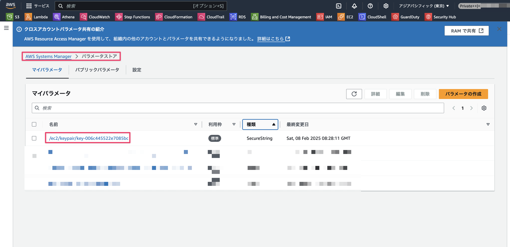
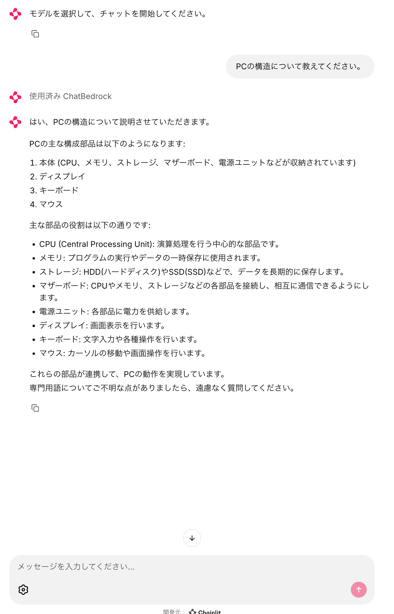
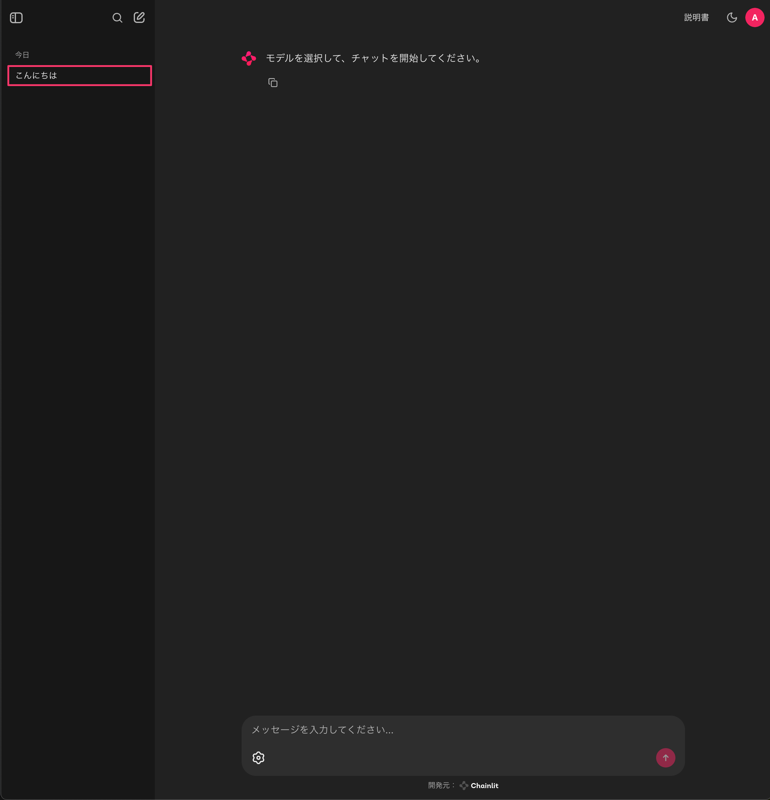
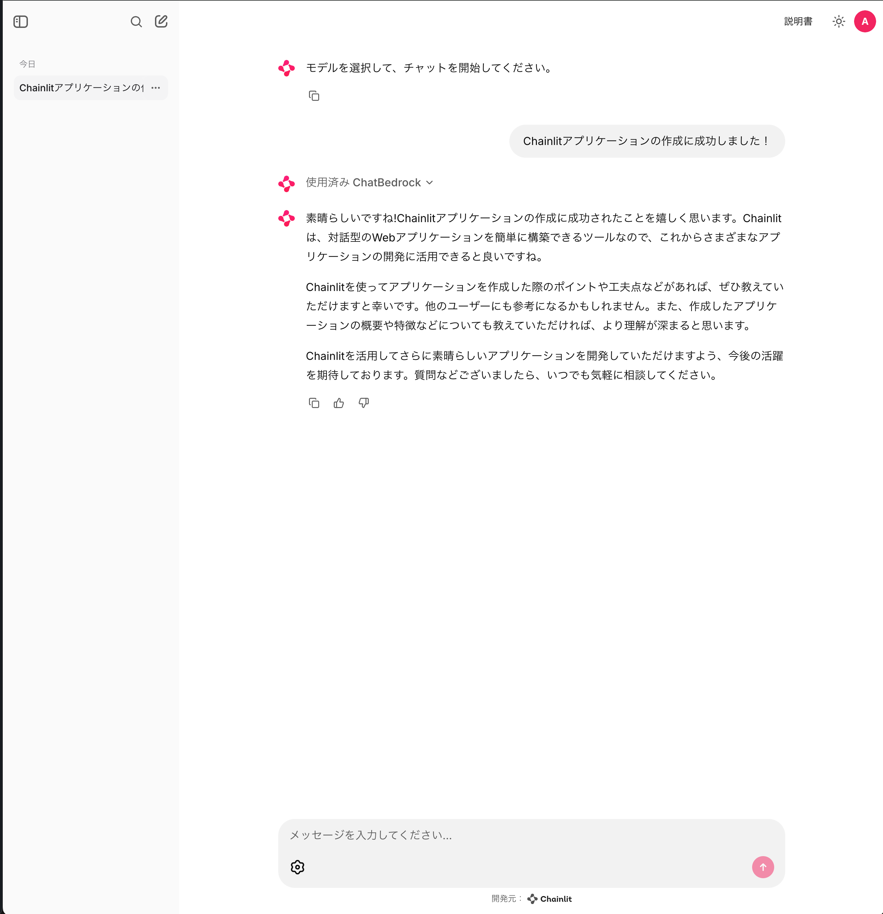

# 生成AIを活用したサンプルアプリケーション

## はじめに

今回は生成AIを使ったサンプルアプリケーションの作成を体験していただきたく、このドキュメントを作成しました。ステップバイステップでOSSのChianlitを使って、作成しているのでぜひ1から試してみていただけますと幸いです。

### 問い合わせ

本ドキュメントの中でご不明点などありましたら、作成者の神野までお問い合わせいただけますと幸いです。

#### 連絡先

神野 雄大（じんの ゆうだい）：jinno.yudai@classmethod.jp

## Chainlitとは

Chainlitは、プロダクションレベルの会話型AIを構築するためのオープンソースPythonパッケージです。わずか数行のPythonコードで、パワフルな会話型AIアプリケーションをすぐに作り始めることが可能です。

### 主な特徴

- **高速な構築**

	数行のPythonコードから簡単に始められ、迅速にアプリケーションを開発可能です。

- **データ永続化**

	ユーザーデータを収集、監視、分析する機能を備え、継続的な改善と最適化を支援します。

- **複数段階の推論の可視化**

	出力が生成されるまでの中間ステップを一目で確認でき、推論プロセスを理解しやすくなっています。

- **マルチプラットフォーム対応**

	一度アシスタントロジックを書くと、あらゆるプラットフォームで利用することができます。

## 注意点

今回作成するアプリケーションは開発用のワークロードです。認証や細かい機能はおざなりになっている箇所もありますが、AIアプリケーション作成を簡易的に主眼を置いているため実際のワークロードとはいくつか異なる点があることをご了承ください。

## 作成するアプリの簡易アーキテクチャ

### アーキテクチャ概要


本アプリケーションは以下のような構成としています。

- 開発環境としてEC2インスタンスを使用
- VS Code Remote SSHで開発環境に接続
- チャットデータはDynamoDBに保存
- Amazon Bedrockで各種AIモデルを利用

## 前提

### 必要なAWSアカウントの権限

- Amazon Bedrockのモデル有効化
	- 使用するモデルをあらかじめ有効化しておく必要がございます。有効化方法については補足2をご参照ください。

### ローカル開発環境

下記ライブラリなどはインストールが事前に必要ですのでご了承ください。VS Codeの拡張機能は記事内で案内します。

- Node.js: v20.16.0
- Python: 3.9.20
- AWS CDK: 2.176.0
- VS Code
	- Remote SSH拡張機能

### 使用するAWSサービス

- Amazon Bedrock
- Amazon EC2
- Amazon DynamoDB
- Amazon S3
- AWS Systems Manager

## 環境の準備

既に作成済みのCDKコードを使用して、環境を構築します。

[https://github.com/yuu551/chainlit-sample-cdk/tree/main](https://github.com/yuu551/chainlit-sample-cdk/tree/main)

### レポジトリを取得

`git clone`を実施してレポジトリから任意のフォルダでソースコードを取得します。

```bash
git clone https://github.com/yuu551/sample-cdk-chainlit
```

### 環境作成

各種モジュールのインストールおよび、`cdk deploy`コマンドを実行して環境を作成します。

```bash
# プロジェクトフォルダの階層へ移動
cd sample-cdk-chainlit

# 各種ライブラリインストール
npm ci

# デプロイ実施
cdk deploy

✨  Deployment time: 179.7s

Outputs:
DevSshEc2Stack.InstanceId = <your-instance-id>
Stack ARN:
arn:aws:cloudformation:ap-northeast-1:<your-account-id>:stack/DevSshEc2Stack/xxx

✨  Total time: 186.5s
```

デプロイが完了すると、以下の情報が出力されるので後ほど使用するためメモをしておきます。

- EC2インスタンスID

### SSHキー情報を取得

CDKでデプロイ後にSSHキーはParameter Storeに保存されているため、
コンソール上から取得しローカルの任意の場所に保管します。

1. `AWS Systems Manager`のコンソール画面から`パラメータストア`を選択

	

2. `ec2/keypair/xxx`を選択

	

3. `複合化された値を表示`を有効にして、秘密鍵を表示してローカルのファイルの保存。ファイル名は`chainlit-ec2-key`など任意の名前で保存する。保存する際はコピーした文字列の`----END OPENSSH PRIVATE KEY-----`行から1行改行して保存する。

	

4. 保存した秘密鍵の権限を変更する。

	```bash
	chmod 600 chainlit-ec2-key
	```

### VS Code Remote SSH設定

取得したSSHキーをEC2インスタンスへの接続設定を行います。

1. VS Codeに「[Remote - SSH](https://marketplace.visualstudio.com/items?itemName=ms-vscode-remote.remote-ssh)」拡張機能をインストールしていない場合はインストール

	

2. `~/.ssh/config` にEC2を接続する情報を追加

	- HostName：`CDK実行時に取得したインスタンスID`
	- Port：`22`
	- IdentityFile：`保存した秘密鍵のパス`
	- User：`ec2-user`
	- ProxtCommand：`aws ssm start-session --target "<インスタンスID>" --document-name AWS-StartSSHSession --parameters "portNumber=22"`

	```
	host chainlit-ec2
	    HostName "<取得したインスタンスID>"
	    Port 22
	    IdentityFile "~/.ssh/chainlit-ec2-key"
	    User ec2-user
	    ProxyCommand  aws ssm start-session --target "<取得したインスタンスID>" --document-name AWS-StartSSHSession --parameters "portNumber=22"
	```

3. SSHコマンドを実行できるか確認します。

	```bash
	ssh chainlit-ec2
	```

	

4. 問題なく接続できればVSCode上でも接続できるか確認してみます。
	左下の`><`マークをクリック後、`ホストに接続する...`を選択

	

5. 今回作成したホスト名を選択（例では`chainlit-ec2`）

	

6. `リモートに接続しました`と表示され、ターミナルも開ければ問題ありません！

	

開発環境用のEC2接続できたので開発環境を整備していきます。

### 開発環境のセットアップ

EC2インスタンスに接続後、必要なパッケージをインストールし、Pythonの仮想環境を作成していきます。

```bash
# システムパッケージの更新
sudo yum update -y

# Python関連パッケージのインストール
sudo yum install -y python3-pip python3-devel

# chainlit用のプロジェクトフォルダを作成
mkdir chainlit-dev
cd chainlit-dev

# 仮想環境の作成
python3 -m venv .venv
source .venv/bin/activate

# 必要なPythonパッケージのインストール
pip install chainlit boto3 langchain langchain_aws
```

## 基本的なチャットアプリケーションの実装

### 固定応答

まずは、LLMとの接続なしで、固定の応答を返す最もシンプルな実装から始めます。
`app.py`ファイルを作成して処理を記載します。

```python
# app.py
import chainlit as cl

@cl.on_chat_start
async def start():
    # チャット開始時の処理
    await cl.Message(
        content="こんにちは！私はシンプルなチャットボットです。メッセージを送ってください。"
    ).send()

@cl.on_message
async def main(message: cl.Message):
    # 固定の応答を返す
    response = "ご質問ありがとうございます。これは固定の応答です。"
    await cl.Message(content=response).send()
```

### ポイント

- `@cl.on_chat_start`
	- チャットセッション開始時に実行される処理
	- ウェルカムメッセージの表示に使用
- `@cl.on_message`
	- ユーザーからメッセージを受信するたびに実行される処理
	- 現段階では固定の文字列を返すだけの簡単な実装

処理が記載したので実際に実行してます。

```bash
# アプリケーションの起動
chainlit run app.py -w
```


問題なく起動できました！！たった数行のコードでこんなリッチなUIを実現可能となります。
試しにメッセージを送ってみます。


固定のメッセージが期待通り返却されました！！

ちなみに今回はファイルアップロードはしない想定なので、`.chainlit/config.toml`で`features.spntaneous_file_upload`は無効にしておきます。

```toml
[features.spontaneous_file_upload]
		# falseに変更
    enabled = false
    # Define accepted file types using MIME types
    # Examples:
    # 1. For specific file types:
    #    accept = ["image/jpeg", "image/png", "application/pdf"]
    # 2. For all files of certain type:
    #    accept = ["image/*", "audio/*", "video/*"]
    # 3. For specific file extensions:
    #    accept = { "application/octet-stream" = [".xyz", ".pdb"] }
    # Note: Using "*/*" is not recommended as it may cause browser warnings
    accept = ["*/*"]
    max_files = 20
    max_size_mb = 500
```

## Amazon Bedrockとの接続

### Bedrock接続の実装

まず、先ほどの固定応答をBedrockを使用した応答に変更します。

```python
import chainlit as cl
from langchain_aws import ChatBedrock
from langchain.schema.runnable import RunnableConfig
from langchain.schema import StrOutputParser

@cl.on_chat_start
async def start():
    try:
        llm = ChatBedrock(
            model_id="anthropic.claude-3-haiku-20240307-v1:0",
            model_kwargs={"temperature": 0.7},
        )

        # StrOutputParserを使用してチェーンを作成
        chain = llm | StrOutputParser()
        cl.user_session.set("chain", chain)

        await cl.Message(
            content="こんにちは！Amazon Bedrockと接続しました。メッセージを送ってください。"
        ).send()
    except Exception as e:
        await cl.Message(
            content=f"Bedrockとの接続に失敗しました: {str(e)}"
        ).send()

@cl.on_message
async def main(message: cl.Message):
    chain = cl.user_session.get("chain")
    response = cl.Message(content="")

    try:
        async for chunk in chain.astream(
            message.content,
            config=RunnableConfig(callbacks=[cl.LangchainCallbackHandler()]),
        ):
            await response.stream_token(chunk)

        await response.send()
    except Exception as e:
        await cl.Message(
            content=f"エラーが発生しました: {str(e)}"
        ).send()

```

ポイントとしては以下の通りとなります。

- `langchain_aws`を使用して、Bedrockとの接続を実現
- ChatBedrockとStrOutputParserを組み合わせた簡潔なチェーン構築
	- パイプライン演算子 ( | )でLLMからの出力を単純な文字列に変換しています
		- `llm.invoke() -> StrOutputParser().invoke()` という処理フローを簡潔に表現しているものです

また`.env`ファイルを作成して、使用するリージョンの設定も行います。
今回使用するリージョン`ap-northeast-1`とします。

```
AWS_DEFAULT_REGION=ap-northeast-1
AWS_REGION=ap-northeast-1
```

### 動作確認

試しに`テストです！！反応してください！！`とメッセージを送ってどう言った反応が返ってくるか確認してみます。


Bedrockと接続してしっかりと反応が返ってきていますね！

### モデル選択機能の追加

最初のソースコードはモデルがHaiku決め打ちだったので、
利用可能なBedrockモデルを動的に取得し、選択できるようにします。

```python
import re
import boto3
import chainlit as cl
from chainlit.input_widget import Select, Slider
from langchain_aws import ChatBedrock
from langchain.schema.runnable import RunnableConfig
from langchain.schema import StrOutputParser

PATTERN = re.compile(r'v\\d+(?!.*\\d[kK]$)')

@cl.on_chat_start
async def start():
    try:
        # 利用可能なモデルの取得
        bedrock = boto3.client("bedrock", region_name="ap-northeast-1")
        response = bedrock.list_foundation_models(byOutputModality="TEXT")

        model_ids = [
            item['modelId']
            for item in response["modelSummaries"]
            if PATTERN.search(item['modelId'])
        ]

        # チャット設定の追加
        settings = await cl.ChatSettings([
            Select(
                id="Model",
                label="Amazon Bedrock - Model",
                values=model_ids,
                initial_index=model_ids.index("anthropic.claude-3-haiku-20240307-v1:0"),
            ),
            Slider(
                id="Temperature",
                label="Temperature",
                initial=0.7,
                min=0,
                max=1,
                step=0.1,
            ),
        ]).send()

        await setup_chain(settings)

        await cl.Message(
            content="モデルを選択して、チャットを開始してください。"
        ).send()

    except Exception as e:
        await cl.Message(
            content=f"設定の初期化に失敗しました: {str(e)}"
        ).send()

@cl.on_settings_update
async def setup_chain(settings):
    try:
        llm = ChatBedrock(
            model_id=settings["Model"],
            model_kwargs={"temperature": settings["Temperature"]}
        )
        chain = llm | StrOutputParser()
        cl.user_session.set("chain", chain)
    except Exception as e:
        await cl.Message(
            content=f"モデルの設定に失敗しました: {str(e)}"
        ).send()

@cl.on_message
async def main(message: cl.Message):
    chain = cl.user_session.get("chain")
    response = cl.Message(content="")

    try:
        async for chunk in chain.astream(
            message.content,
            config=RunnableConfig(callbacks=[cl.LangchainCallbackHandler()]),
        ):
            await response.stream_token(chunk)

        await response.send()
    except Exception as e:
        await cl.Message(
            content=f"エラーが発生しました: {str(e)}"
        ).send()

```

先ほどとの違いはBedrockのクライアントを作成し、該当リージョンで使用可能なモデル一覧を取得するようにしました。

### 動作確認

実装が完了すると、モデルや設定を選択できる歯車ボタンが表示されるので押下してみます。


押下後はモデルや`Temprerature`を変更できます。
有効化しているモデルに関しては実行が可能となります。


問題なく変更可能となっていますね！

### プロンプトテンプレートの追加

より柔軟な応答を得るためにプロンプトテンプレートも実装可能です。

```python
import re
import boto3
import chainlit as cl
from chainlit.input_widget import Select, Slider
from langchain_aws import ChatBedrock
from langchain.schema.runnable import RunnableConfig
from langchain.schema import StrOutputParser
from langchain.prompts import ChatPromptTemplate

PATTERN = re.compile(r'v\\d+(?!.*\\d[kK]$)')

＃ システムプロンプトを定義
DEFAULT_SYSTEM_PROMPT = """あなたは親切で丁寧なアシスタントです。
ユーザーの質問に対して、簡潔で分かりやすい回答を心がけてください。
専門用語を使用する場合は、必要に応じて説明を加えてください。"""

@cl.on_chat_start
async def start():
    try:
        # 利用可能なモデルの取得
        bedrock = boto3.client("bedrock", region_name="ap-northeast-1")
        response = bedrock.list_foundation_models(byOutputModality="TEXT")

        model_ids = [
            item['modelId']
            for item in response["modelSummaries"]
            if PATTERN.search(item['modelId'])
        ]

        # チャット設定の追加
        settings = await cl.ChatSettings([
            Select(
                id="Model",
                label="Amazon Bedrock - Model",
                values=model_ids,
                initial_index=model_ids.index("anthropic.claude-3-haiku-20240307-v1:0"),
            ),
            Slider(
                id="Temperature",
                label="Temperature",
                initial=0.7,
                min=0,
                max=1,
                step=0.1,
            )
        ]).send()

        await setup_chain(settings)

        await cl.Message(
            content="モデルを選択して、チャットを開始してください。"
        ).send()

    except Exception as e:
        await cl.Message(
            content=f"設定の初期化に失敗しました: {str(e)}"
        ).send()

@cl.on_settings_update
async def setup_chain(settings):
    try:
        llm = ChatBedrock(
            model_id=settings["Model"],
            model_kwargs={"temperature": settings["Temperature"]}
        )

        # プロンプトテンプレートの作成
        prompt = ChatPromptTemplate.from_messages([
            ("system", DEFAULT_SYSTEM_PROMPT),
            ("human", "{input}")
        ])

        # チェーンの作成
        chain = prompt | llm | StrOutputParser()
        cl.user_session.set("chain", chain)
    except Exception as e:
        await cl.Message(
            content=f"モデルの設定に失敗しました: {str(e)}"
        ).send()

@cl.on_message
async def main(message: cl.Message):
    chain = cl.user_session.get("chain")
    response = cl.Message(content="")

    try:
        async for chunk in chain.astream(
            {"input": message.content},  # プロンプトテンプレートに合わせて入力形式を変更
            config=RunnableConfig(callbacks=[cl.LangchainCallbackHandler()]),
        ):
            await response.stream_token(chunk)

        await response.send()
    except Exception as e:
        await cl.Message(
            content=f"エラーが発生しました: {str(e)}"
        ).send()

```

### ポイント

- DEFAULT_SYSTEM_PROMPTでシステムプロンプトを定義
- `ChatPromptTemplate`でプロンプトのテンプレートを作成
- チェーン化してプロンプトを読み込むように実装

### 動作確認

試しにPCの構造について教えてくださいと質問してみます。




システムプロンプトに組み込まれて返事が返却されていますね！

ここまででも充分AIにQ&Aを行なって回答してもらえるようになりましたが、せっかくのチャット機能なので文脈を記憶できるように修正もしていきます。

### 文脈を読み込む

セッション情報に文脈を読み込むよう修正します。

```python
import re
import boto3
import chainlit as cl
from chainlit.input_widget import Select, Slider
from langchain_aws import ChatBedrock
from langchain.schema.runnable import RunnableConfig
from langchain.schema import StrOutputParser
from langchain.prompts import ChatPromptTemplate
from langchain.memory import ConversationBufferMemory
from langchain.schema import HumanMessage, AIMessage

PATTERN = re.compile(r'v\\d+(?!.*\\d[kK]$)')

DEFAULT_SYSTEM_PROMPT = """"""

@cl.on_chat_start
async def start():
    try:
        # 利用可能なモデルの取得
        bedrock = boto3.client("bedrock", region_name="ap-northeast-1")
        response = bedrock.list_foundation_models(byOutputModality="TEXT")

        model_ids = [
            item['modelId']
            for item in response["modelSummaries"]
            if PATTERN.search(item['modelId'])
        ]

        # チャット設定の追加
        settings = await cl.ChatSettings([
            Select(
                id="Model",
                label="Amazon Bedrock - Model",
                values=model_ids,
                initial_index=model_ids.index("anthropic.claude-3-haiku-20240307-v1:0"),
            ),
            Slider(
                id="Temperature",
                label="Temperature",
                initial=0.7,
                min=0,
                max=1,
                step=0.1,
            )
        ]).send()

        # 会話履歴の初期化
        cl.user_session.set("message_history", [])

        await setup_chain(settings)

        await cl.Message(
            content="モデルを選択して、チャットを開始してください。"
        ).send()

    except Exception as e:
        await cl.Message(
            content=f"設定の初期化に失敗しました: {str(e)}"
        ).send()

@cl.on_settings_update
async def setup_chain(settings):
    try:
        llm = ChatBedrock(
            model_id=settings["Model"],
            model_kwargs={"temperature": settings["Temperature"]}
        )

        # プロンプトテンプレートの作成（会話履歴を含める）
        prompt = ChatPromptTemplate.from_messages([
            ("system", DEFAULT_SYSTEM_PROMPT),
            ("human", "これまでの会話内容:\\n{chat_history}\\n\\n現在の質問:\\n{input}")
        ])

        # チェーンの作成
        chain = prompt | llm | StrOutputParser()
        cl.user_session.set("chain", chain)
    except Exception as e:
        await cl.Message(
            content=f"モデルの設定に失敗しました: {str(e)}"
        ).send()

@cl.on_message
async def main(message: cl.Message):
    chain = cl.user_session.get("chain")
    message_history = cl.user_session.get("message_history")
    response = cl.Message(content="")

    try:
        # 会話履歴の文字列を作成
        chat_history = "\\n".join([
            f"Human: {msg['human']}\\nAssistant: {msg['ai']}"
            for msg in message_history
        ])

        async for chunk in chain.astream(
            {
                "input": message.content,
                "chat_history": chat_history
            },
            config=RunnableConfig(callbacks=[cl.LangchainCallbackHandler()]),
        ):
            await response.stream_token(chunk)

        # 会話履歴に追加
        message_history.append({
            "human": message.content,
            "ai": response.content
        })
        cl.user_session.set("message_history", message_history)

        await response.send()
    except Exception as e:
        await cl.Message(
            content=f"エラーが発生しました: {str(e)}"
        ).send()
```

### ポイント

- セッション情報に会話履歴を保存して、文脈を読み取れるように修正
	- `cl.user_session`を使用して会話履歴の保存および参照を実施
- プロンプトテンプレートに今までの会話内容を組み込むように修正

### 動作確認

最初にカレーの作り方を聞いて、その次にラーメンの作り方を聞いてみます。


質問および順序を覚えていますね！！次に文脈に沿った質問もしてみます。


これで1通りのAIアプリ作成を体験できたかなと思います。
ただ、本格的に使いたいとなると、今までのチャット履歴を永続化したいおよび認証機能を実装したいなどあるかと思います。

## DynamoDBによるチャット履歴の永続化

[公式ドキュメント](https://docs.chainlit.io/data-layers/overview)によるとデータの永続化は幾つか選択肢があります。
その中でもコミュニティが提供しているDynamoDB レイヤーを使用していきたいと思います。

### DynamoDBラッパーの実装

早速ですがChainlitのDynamoDBデータレイヤーには、Decimal型の処理に関して一部エラーが発生するため、これを解決するために、ラッパークラスを実装する必要があります。

```python
# database.py
import json
from decimal import Decimal
from chainlit.data.dynamodb import DynamoDBDataLayer

class DecimalDynamoDBWrapper:
    """
    ChainlitのDynamoDBデータレイヤーをラップし、Decimal型の変換を処理するクラス

    DynamoDBはPythonのfloat型を直接サポートしていないため、
    Decimal型への変換が必要です。このラッパーは自動的にその変換を行います。
    """
    def __init__(self, data_layer: DynamoDBDataLayer):
        self.data_layer = data_layer
        self._wrap_serialize_item()
        self._wrap_deserialize_item()

    def _wrap_serialize_item(self):
        """
        DynamoDBに保存する前にfloat型をDecimal型に変換
        """
        original_serialize = self.data_layer._serialize_item

        def convert_floats_to_decimal(obj):
            if isinstance(obj, dict):
                return {key: convert_floats_to_decimal(value) for key, value in obj.items()}
            elif isinstance(obj, list):
                return [convert_floats_to_decimal(item) for item in obj]
            elif isinstance(obj, float):
                return Decimal(str(obj))
            return obj

        def wrapped_serialize_item(item):
            converted_item = convert_floats_to_decimal(item)
            return original_serialize(converted_item)

        self.data_layer._serialize_item = wrapped_serialize_item

```

### ラッパークラスを実装した理由

下記理由やバグのためです。

- DynamoDBはfloat型を直接サポートしていない
- ChainlitのデフォルトのデータレイヤーではDecimal型の変換が適切に処理されない
- チャット設定（temperature等）がfloat型で保存できない

### ラッパークラスの呼び出し方法

```python
import chainlit.data as cl_data
from chainlit.data.dynamodb import DynamoDBDataLayer
from chainlit.data.storage_clients.s3 import S3StorageClient
from database import DecimalDynamoDBWrapper

# app.pyでの初期化
storage_client = S3StorageClient(bucket="chainlit-storage-[ACCOUNT_ID]-[REGION]")
data_layer = DynamoDBDataLayer(table_name="ChainlitData", storage_provider=storage_client)

# ラッパーでデータレイヤーを拡張
wrapped_data_layer = DecimalDynamoDBWrapper(data_layer)

# Chainlitのデータレイヤーを置き換え
cl_data._data_layer = wrapped_data_layer.data_layer
```

これでDynamoDBに会話した履歴は保存されるようになりました。
ただ、ログとして保存できるようになっただけなのでログインしたユーザーに紐づいて、いつでも会話が復元できるように実装を進めていきます。

### 補足

同じように上記エラーでPull Requestが上がっていましたが、現状マージされていない状態です。
いつか修正が入るかもしれませんが直近は対応される雰囲気ではなさそうだったので、ラッパークラスを今回は使用しています。

[https://github.com/Chainlit/chainlit/pull/1163](https://github.com/Chainlit/chainlit/pull/1163)

### ユーザー認証の実装

認証機能は、DynamoDBの`UserAuth`テーブルを使用して実装します。下記実装を`auth.py` を作成し記載します。

```python
import hashlib
import boto3
import chainlit as cl
import os
from dotenv import load_dotenv
import datetime
import uuid

# .envファイルから環境変数を読み込み
load_dotenv()

class UserAuth:
    def __init__(self, chainlit_table_name, auth_table_name):
        self.dynamodb = boto3.resource('dynamodb')
        self.chainlit_table = self.dynamodb.Table(chainlit_table_name)
        self.auth_table = self.dynamodb.Table(auth_table_name)
        self._ensure_admin_exists()

    def hash_password(self, password: str) -> str:
        return hashlib.sha256(password.encode()).hexdigest()

    def _ensure_admin_exists(self):
        """管理者ユーザーが存在しない場合は作成する"""
        try:
            admin_username = os.getenv('ADMIN_USERNAME')
            admin_password = os.getenv('ADMIN_PASSWORD')

            if not admin_username or not admin_password:
                print("Warning: Admin credentials not found in environment variables")
                return

            # 管理者ユーザーの存在確認
            admin_auth = self.get_user_auth(admin_username)

            if not admin_auth:
                # 管理者ユーザーが存在しない場合は作成
                try:
                    self.create_user(admin_username, admin_password, role="admin")
                    print(f"Admin user '{admin_username}' created successfully")
                except Exception as e:
                    print(f"Error creating admin user: {str(e)}")
            else:
                print(f"Admin user '{admin_username}' already exists")

        except Exception as e:
            print(f"Error in _ensure_admin_exists: {str(e)}")

    def get_user_auth(self, username: str):
        """認証情報の取得"""
        response = self.auth_table.get_item(
            Key={
                'username': username
            }
        )
        return response.get('Item')

    def create_user(self, username: str, password: str, role: str = "user"):
        """ユーザーを作成する"""
        if role != "admin":
            raise PermissionError("Only admin users can be created")

        hashed_password = self.hash_password(password)

        # 認証情報をAuthテーブルに保存
        auth_item = {
            'username': username,
            'password': hashed_password,
            'role': role,
            'createdAt': datetime.datetime.now(datetime.timezone.utc).isoformat()
        }

        self.auth_table.put_item(Item=auth_item)

        # ChainlitDataテーブルへの書き込み
        self.chainlit_table.put_item(
            Item={
                'PK': f"USER#{username}",
                'SK': "USER",
                'id': str(uuid.uuid4()),
                'identifier': username,
                'createdAt': datetime.datetime.now(datetime.timezone.utc).isoformat(),
                'metadata': {}
            }
        )

    def verify_user(self, username: str, password: str):
        """ユーザー認証"""
        user_auth = self.get_user_auth(username)
        if not user_auth:
            return None

        hashed_password = self.hash_password(password)

        if user_auth['password'] == hashed_password:
            print("test")
            return cl.User(
                identifier=username,
                metadata={"role": user_auth['role'], "provider": "credentials"}
            )
        return None
```

ポイントとしてテーブルは独自で作成した`UserAuth`も使用することとなります。`UserAuth`テーブルは認証用のテーブルでユーザー名とパスワードが正しいかチェックする役割となります。認証はChainlit側でカバーしてくれない範囲なので自前で実装することになります。

一方でChainlit側のテーブル`ChainlitData`にもユーザー情報は必要なのでこちらも合わせてデータを登録しておきます。

また初回起動時に管理者ユーザーだけログインできるよう、ユーザーを作成するため、`.env`に管理者情報を追加します。

- ADMIN_USERNAME：任意の管理者ユーザー名
- ADMIN_PASSWORD：任意の管理者パスワード

```
ADMIN_USERNAME=XXX
ADMIN_PASSWORD=YYY
```

今回は初回起動時のみ管理者ユーザーを作成してログインできるようにしていますが、任意のユーザーを登録できるようなシェルも用意したので補足3をご参照ください。

### Chainlitでの認証設定

認証処理を実装したので、今度はChainlit側に認証機能を盛り込みます。
`cl.password_auth_callback`を使って処理を記載します。

```python
# app.py
import chainlit as cl
from auth import UserAuth

# 認証インスタンスの初期化
user_auth = UserAuth(
    chainlit_table_name="ChainlitData",
    auth_table_name="UserAuth"
)

@cl.password_auth_callback
async def auth_callback(username: str, password: str):
    """
    Chainlitの認証コールバック

    Args:
        username (str): ユーザー名
        password (str): パスワード

    Returns:
        User | None: 認証成功時はユーザーオブジェクト、失敗時はNone
    """
    user = user_auth.verify_user(username, password)

    if user:
        return await cl_data.get_data_layer().get_user(username)
    return None
```

実装が完了したら、Chainlit側でシークレット管理も必要なので下記コマンドを実行しておきます。

```
chainlit create-secret

Copy the following secret into your .env file. Once it is set, changing it will logout all users with active sessions.
CHAINLIT_AUTH_SECRET="XXX"
WARNING: All log messages before absl::InitializeLog() is called are written to STDERR
E0000 00:00:1739249012.261197   15438 init.cc:232] grpc_wait_for_shutdown_with_timeout() timed out.
```

実行結果に秘密鍵が出力されるので、`.env`にそのままコピーします。

```
CHAINLIT_AUTH_SECRET="XXX"

```

初期のユーザー名、パスワードでログインできるか確認してみます。


ログイン後


無事ログインできて認証できましたね！
後は会話を再開できるように処理を追記します。

### 会話再開機能の追加

まずはチャットの会話内容を引き出せるようにセッション情報に格納するようにします。
セッション情報はDynamoDBに保存されます。

具体的には`cl.user_session`を使用して、格納および参照しています。

```python
@cl.on_message
async def main(message: cl.Message):
    chain = cl.user_session.get("chain")
    # 会話履歴のセッション情報を取得
    message_history = cl.user_session.get("message_history")
    response = cl.Message(content="")

    try:
        chat_history = "\\n".join([
            f"Human: {msg['human']}\\nAssistant: {msg['ai']}"
            for msg in message_history
        ])

        async for chunk in chain.astream(
            {
                "input": message.content,
                "chat_history": chat_history
            },
            config=RunnableConfig(callbacks=[cl.LangchainCallbackHandler()]),
        ):
            await response.stream_token(chunk)

        # 会話履歴に追加
        message_history.append({
            "human": message.content,
            "ai": response.content
        })
        # 会話履歴をセッションに追加。
        cl.user_session.set("message_history", message_history)

        await response.send()

```

会話再開時の処理は`cl.on_chat_resume`に記載します。
ここでは処理中に格納された以前の設定や会話履歴を取り出して再度設定します。

```python
@cl.on_chat_resume
async def on_chat_resume(thread):
    # 会話履歴の初期化
    message_history = []

    # スレッドのメタデータから会話履歴を復元
    if thread.get("metadata") and thread["metadata"].get("message_history"):
        message_history = thread["metadata"]["message_history"]

    # セッションに会話履歴を設定
    cl.user_session.set("message_history", message_history)

    # チャット設定を復元
    settings = cl.user_session.get("chat_settings")
    if settings:
        await setup_chain(settings)

```

この状態で新規に会話してみます。


更に新規会話を実施して、再度こんにちはとあるタブを押下します。



この状態で再度、私の最初の会話を覚えていますかと聞いてみます。


「こんにちは」と言ったと返事できていますね！！過去のチャット履歴を復元できる機能も無事実装できました。後は、履歴管理機能を実装したことでフィードバックも実行できます。


試しに、いいねボタンを押下してみるとモーダルが立ち上がってコメントと共にフィードバックを送信できます。


フィードバックはDynamoDBに下記形式で保存されます。

```json
{
  "PK": {
    "S": "THREAD#48dc21cf-e78f-436e-8e48-5a72132a7db9"
  },
  "SK": {
    "S": "STEP#d0f7fe7c-ec94-49d9-90f3-29302c1c858e"
  },
  "createdAt": {
    "S": "2025-02-11T08:01:08.620675Z"
  },
  "end": {
    "S": "2025-02-11T08:01:11.385050Z"
  },
  "feedback": {
    "M": {
      "comment": {
        "S": "最高のアドバイスです！！"
      },
      "forId": {
        "S": "d0f7fe7c-ec94-49d9-90f3-29302c1c858e"
      },
      "id": {
        "S": "THREAD#48dc21cf-e78f-436e-8e48-5a72132a7db9::STEP#d0f7fe7c-ec94-49d9-90f3-29302c1c858e"
      },
      "threadId": {
        "S": "48dc21cf-e78f-436e-8e48-5a72132a7db9"
      },
      "value": {
        "N": "1"
      }
    }
  },
  "generation": {
    "NULL": true
  },
  "id": {
    "S": "d0f7fe7c-ec94-49d9-90f3-29302c1c858e"
  },
  "input": {
    "S": "手作りすると本当に美味しくなるのは何が美味しくなるんでしたっけ？\\n質問を忘れまして・・・"
  },
  "isError": {
    "BOOL": false
  },
  "language": {
    "NULL": true
  },
  "metadata": {
    "M": {}
  },
  "name": {
    "S": "on_message"
  },
  "output": {
    "S": ""
  },
  "parentId": {
    "S": "59293aa3-bcde-4975-af34-5ddba60919fa"
  },
  "showInput": {
    "S": "json"
  },
  "start": {
    "S": "2025-02-11T08:01:08.620694Z"
  },
  "streaming": {
    "BOOL": false
  },
  "tags": {
    "NULL": true
  },
  "threadId": {
    "S": "48dc21cf-e78f-436e-8e48-5a72132a7db9"
  },
  "type": {
    "S": "run"
  }
}

```

## おわりに

Chainlitを使ったチャットアプリ作成はどうでしたか？？少し癖はあるものの、出来合いのコードが多く少し実装するだけでリッチなUIを再現できるのは最高ですね！！

## 補足1：ソースコード完全版での手順

### 完全版コード

今回はステップバイステップで実装しましたが、最初から実装済みのコードがいい場合は下記CDKコードを使ってデプロイすることでEC2にコードも配置された状態となります。本記事で紹介したようにEC2にSSHで接続して、サーバーを起動するコマンドを実行することで、Chainlitを体験することが可能です。

また、お手持ちのエディターで環境を作成する場合は、CloudShellでデプロイも可能なので補足6をご参照ください。

### ソースコード

[https://github.com/yuu551/sample-chainlit-all-in](https://github.com/yuu551/sample-chainlit-all-in)

### 手順

1. GitHubからソースコードをPull

	```bash
	git clone https://github.com/yuu551/sample-chainlit-all-in
	```

2. `cdk deploy`コマンドを実施

	```
	cdk deploy
	```

3. デプロイが完了したら、出力されたインスタンスIDをメモする

	```
	✅  CdkAllInCodeStack
	
	✨  Deployment time: 205.22s
	
	Outputs:
	CdkAllInCodeStack.InstanceId = i-xxx
	```

4. 作成したEC2の秘密鍵をパラメータストアから取得し、任意の名前で保存する。保存する際はコピーした文字列の`----END OPENSSH PRIVATE KEY-----`行から1行改行して保存する。

	

5. 保存した秘密鍵の権限を変更する。

	```bash
	chmod 600 chainlit-ec2-key
	```

6. VS Codeに「[Remote - SSH](https://marketplace.visualstudio.com/items?itemName=ms-vscode-remote.remote-ssh)」拡張機能をインストールしていない場合はインストール

	

7. `~/.ssh/config` にEC2を接続する情報を追加

	- HostName：`CDK実行時に取得したインスタンスID`
	- Port：`22`
	- IdentityFile：`保存した秘密鍵のパス`
	- User：`ec2-user`
	- ProxtCommand：`aws ssm start-session --target "<インスタンスID>" --document-name AWS-StartSSHSession --parameters "portNumber=22"`

	```
	host chainlit-ec2
	    HostName "<取得したインスタンスID>"
	    Port 22
	    IdentityFile "~/.ssh/chainlit-ec2-key"
	    User ec2-user
	    ProxyCommand  aws ssm start-session --target "<取得したインスタンスID>" --document-name AWS-StartSSHSession --parameters "portNumber=22"
	```

8. SSHコマンドを実行できるか確認

	```bash
	ssh chainlit-ec2
	```

	

9. 問題なく接続できればVSCode上でも接続できるか確認
	左下の`><`マークをクリック後、`ホストに接続する...`を選択

	 

10. 今回作成したホスト名を選択（例では`chainlit-ec2`）

	

11. `リモートに接続しました`と表示され、該当のフォルダ（`chainlit-dev`）を開く

	

12. VSCodeのターミナルで下記コマンドを実行して、Pythonの仮想環境を有効にする

	```bash
	source .venv/bin/activate
	```

13. `.env`ファイルの管理者ユーザー名とパスワードを任意のユーザー名およびパスワードに変更する

	```bash
	AWS_DEFAULT_REGION=ap-northeast-1
	AWS_REGION=ap-northeast-1
	# 適切なユーザー名とパスワードに変更
	ADMIN_USERNAME="XXX"
	ADMIN_PASSWORD="YYY"
	CHAINLIT_AUTH_SECRET="XXX"
	```

14. 下記コマンドを実施してサーバーを起動する

	```bash
	chainlit run app.py -w
	```

15. ログイン画面が表示されるため、`.env`で設定したユーザー名とパスワードを入力

	

16. チャットを入力して、問題なくAIモデルから返事があることを確認

	

以上となります。今回ステップバイステップで実施した流れをある程度の単位でパッケージ化しているので、説明はある程度省略しております。

## 補足2：モデルの有効化

1. コンソール画面で Amazon Bedrock > Bedrock configurations > モデルアクセス の順に進みます

2. ベースモデル一覧の中から使用したいモデルの「リクエスト可能」をクリックしてモデルアクセスをリクエストします。

	

3. 数分後アクセスが付与されていることを確認

	

## 補足3：ユーザーの登録

現状、初回実行時に管理者ユーザーしか登録できないので他のユーザーを登録したくなった際のスクリプトも共有させてください。
簡易的にCloudShellで実行できるような作りとしております。

```bash
#!/bin/bash

# 引数チェック
if [ "$#" -ne 5 ]; then
    echo "Usage: $0 <username> <password> <role> <chainlit_table> <auth_table>"
    exit 1
fi

USERNAME=$1
PASSWORD=$2
ROLE=$3
CHAINLIT_TABLE=$4
AUTH_TABLE=$5

# 現在時刻（ISO 8601形式）
TIMESTAMP=$(date -u +"%Y-%m-%dT%H:%M:%SZ")
# UUID生成
UUID=$(uuidgen)
# パスワードのSHA256ハッシュ化
HASHED_PASSWORD=$(echo -n "$PASSWORD" | sha256sum | awk '{print $1}')

# Authテーブルにユーザー認証情報を登録
aws dynamodb put-item \\
    --table-name $AUTH_TABLE \\
    --item '{
        "username": {"S": "'"$USERNAME"'"},
        "password": {"S": "'"$HASHED_PASSWORD"'"},
        "role": {"S": "'"$ROLE"'"},
        "createdAt": {"S": "'"$TIMESTAMP"'"}
    }'

# ChainlitDataテーブルにユーザー情報を登録
aws dynamodb put-item \\
    --table-name $CHAINLIT_TABLE \\
    --item '{
        "PK": {"S": "USER#'"$USERNAME"'"},
        "SK": {"S": "USER"},
        "id": {"S": "'"$UUID"'"},
        "identifier": {"S": "'"$USERNAME"'"},
        "createdAt": {"S": "'"$TIMESTAMP"'"},
        "metadata": {"M": {}}
    }'

echo "User $USERNAME created successfully"
```

このシェルを下記引数を渡して、CloudShell上で実行します。

- username：任意のユーザー名
- password：任意のパスワード名
- role：任意のロール名
	- 実施としてほとんど使われていないので任意の値でいいかと思います。`user`など
- chainlit_table：Chainlitが使用するテーブル名（今回なら`ChainlitData`）
- auth_table：独自で使用する認証用のテーブル名（今回なら`UserAuth`）

```bash
sh ./create_user.sh <username> <password> <role> <chainlit_table> <auth_table>
```

### ユーザー情報の削除や更新について

ユーザーの削除や更新はDynamoDBのコンソール上から対応もしくは、ご自身で同じようなシェルを作成していただくのがいいかと思います。
パスワード更新を手動でされる際は、ハッシュ化することを忘れないようご注意ください。

## 補足4：リソースの停止 & 削除

サーバーを立ち上げたままだと、コストが嵩んでしまうため使用しない場合は停止していただくのがいいかと思います。

AWSコンソール上から、EC2のインスタンス一覧画面を開き、停止したいChainlitのサーバーにチェックを入れて、`インスタンスの状態 > インスタンスを停止`ボタンから停止します。


また全リソースを削除する場合は`cdk destroy`コマンドで全て削除します。

```bash
cdk destroy
```

## 補足5：CloudShellでデプロイ

CloudShellでもデプロイ可能となります。
CDKの環境を作成するのが煩わしい場合はぜひご検討ください。

1. コンソール上から`CloudShell`と検索して、CloudShellを開く

	

2. レポジトリからソースコードを`Clone` し、ディレクトリを移動（今回は完全版でデプロイ実施しております）

	```bash
	# ソースコードをclone
	git clone https://github.com/yuu551/sample-chainlit-all-in.git
	# ディレクトリを移動
	cd sample-chainlit-all-in
	```

3. ディレクトリを移動して、下記コマンドを順番に実施し、デプロイを実施

	```bash
	# 各種パッケージをインストール
	npm ci
	# Bootstrap
	npx cdk bootstrap
	# デプロイ
	npx cdk deploy
	
	# yesかnoで聞かれるのでy
	Do you wish to deploy these changes (y/n)? y
	```

4. デプロイが完了したら、出力されたインスタンスIDをメモする

	```
	✅  CdkAllInCodeStack
	
	✨  Deployment time: 205.22s
	
	Outputs:
	CdkAllInCodeStack.InstanceId = i-xxx
	```

5. 作成したEC2の秘密鍵をパラメータストアから取得し、任意の名前で保存する。保存する際はコピーした文字列の`----END OPENSSH PRIVATE KEY-----`行から1行改行してローカルの端末に保存する。

	

6. 保存した秘密鍵の権限を変更する。

	```bash
	chmod 600 chainlit-ec2-key
	```

7. VS Codeに「[Remote - SSH](https://marketplace.visualstudio.com/items?itemName=ms-vscode-remote.remote-ssh)」拡張機能をインストールしていない場合はインストール

	

8. `~/.ssh/config` にEC2を接続する情報を追加

	- HostName：`CDK実行時に取得したインスタンスID`
	- Port：`22`
	- IdentityFile：`保存した秘密鍵のパス`
	- User：`ec2-user`
	- ProxtCommand：`aws ssm start-session --target "<インスタンスID>" --document-name AWS-StartSSHSession --parameters "portNumber=22"`

	```
	host chainlit-ec2
	    HostName "<取得したインスタンスID>"
	    Port 22
	    IdentityFile "~/.ssh/chainlit-ec2-key"
	    User ec2-user
	    ProxyCommand  aws ssm start-session --target "<取得したインスタンスID>" --document-name AWS-StartSSHSession --parameters "portNumber=22"
	```

9. SSHコマンドを実行できるか確認

	```bash
	ssh chainlit-ec2
	```

	

10. 問題なく接続できればVSCode上でも接続できるか確認
	左下の`><`マークをクリック後、`ホストに接続する...`を選択

	

11. 今回作成したホスト名を選択（例では`chainlit-ec2`）

	

12. `リモートに接続しました`と表示され、該当のフォルダ（`chainlit-dev`）を開く

	

13. VSCodeのターミナルで下記コマンドを実行して、Pythonの仮想環境を有効にする

	```bash
	source .venv/bin/activate
	```

14. `.env`ファイルの管理者ユーザー名とパスワードを任意のユーザー名およびパスワードに変更する

	```bash
	AWS_DEFAULT_REGION=ap-northeast-1
	AWS_REGION=ap-northeast-1
	# 適切なユーザー名とパスワードに変更
	ADMIN_USERNAME="XXX"
	ADMIN_PASSWORD="YYY"
	CHAINLIT_AUTH_SECRET="XXX"
	```

15. 下記コマンドを実施してサーバーを起動する

	```bash
	chainlit run app.py -w
	```

16. ログイン画面が表示されるため、`.env`で設定したユーザー名とパスワードを入力

	

17. チャットを入力して、問題なくAIモデルから返事があることを確認

18. 削除時は`destroy`コマンドで削除。

	```bash
	npx cdk destroy
	```

120日間CloudShellを実行しなかった場合は、デプロイ用のリソースが削除されるため`destroy`コマンドが実行できないケースもあるかと思います。そういった場合はコンソール上からCloudFormationの画面を開き、`CdkAllInCodeStack`を削除していただければ作成されたリソースは削除されます。


## 補足6：Q & A

- Q. 秘密鍵をコピーして使用しても不正なフォーマットとエラーが出てEC2に接続できない。

	- A. パラメータストアからコピーしたファイルに改行が入っていない可能性があるので`----END OPENSSH PRIVATE KEY-----`行から一行改行して保存する。

- Q. CDKを初めて実行するが`deploy`コマンドが実行できない

	- A. `cdk bootstrap`コマンドを先に実行してCDK用のS3バケットを作成する必要がある。

- Q. AWSのデフォルトプロファイル以外を使用してSSH接続を実現したい

	- A. `~/.ssh/config`にホストを追加する際に、`--profile`パラメータでプロファイル名を指定。下記がサンプルである。

		```
		host chainlit-ec2
		    HostName "i-xxx"
		    Port 22
		    IdentityFile "~/.ssh/chainlit-ec2-key"
		    User ec2-user
		    ProxyCommand  aws ssm start-session --target "i-xxx" --document-name AWS-StartSSHSession --parameters "portNumber=22" --profile private-profile
		```

- Q. VSCodeで対象のインスタンスに対してSSHで接続できない。

	- A. まずはターミナル上でSSHできるかどうか確認していただきたい。使用するプロファイルによってはMFAトークンなど必要になる可能性もあるため、ターミナル上で問題なく接続できるか、またターミナルで接続してセッションを張った状態でVSCodeで再度接続できるかご確認いただきたい。
